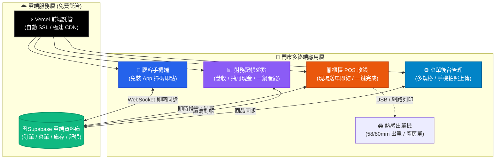
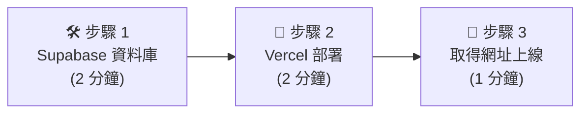
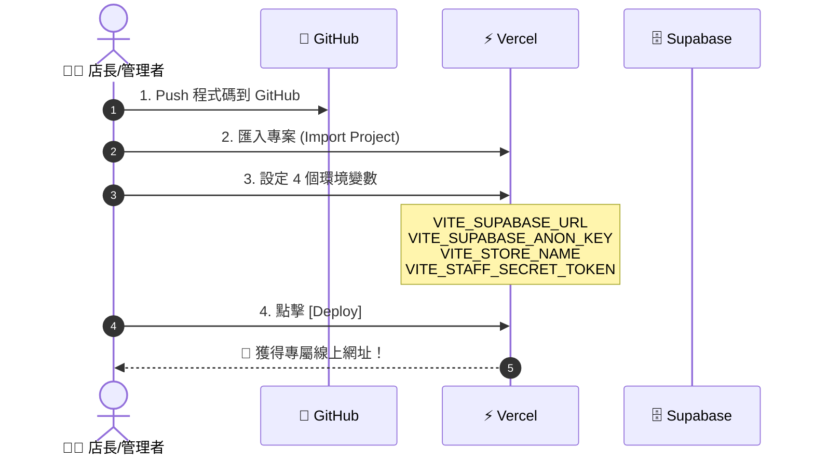
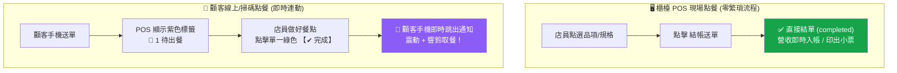

# 🚀 系統安裝與部署手冊 (5 分鐘快速圖解指南)

> 💡 **圖解重點**：全自動雲端串接、免伺服器維護、5 分鐘即刻上線！

---

## 🗺️ 系統整體架構圖 (System Architecture)



---

## ⏱️ 5 分鐘快速部署 3 步驟圖解



---

### 🛠️ 步驟 1：建立 Supabase 資料庫（2 分鐘）

```
┌────────────────────────────────────────────────────────┐
│ 1. 登入 Supabase ➔ [New Project] (選 Singapore / Tokyo) │
│ 2. 點左側 [SQL Editor] ➔ 貼上 supabase_schema_universal.sql │
│ 3. 點擊綠色 [Run] ➔ 出現 Success 代表資料表建置完成！   │
│ 4. 點 [Project Settings] ➔ [API] 複製下方 2 個金鑰：    │
│    • Project URL (例: https://xxxx.supabase.co)        │
│    • anon public Key (例: eyJhbGciOi...)               │
└────────────────────────────────────────────────────────┘
```

---

### 🚀 步驟 2：Vercel 一鍵部署（2 分鐘）



#### 🔑 環境變數填寫對照表：
| 變數名稱 (Key) | 說明與填寫範例 |
|---|---|
| `VITE_SUPABASE_URL` | 您的 Supabase Project URL（例：`https://xxxx.supabase.co`） |
| `VITE_SUPABASE_ANON_KEY` | 您的 Supabase Anon Public Key |
| `VITE_STORE_NAME` | 門市名稱（例：`龍城麵線` 或 `蘆洲七號店`） |
| `VITE_STAFF_SECRET_TOKEN` | 後台專屬安全鑰匙（例：`dg_8f2a1c`，**請自行自訂**） |

---

### 💻 步驟 3：四大入口網址圖解（1 分鐘）

```
🌐 您的專屬系統入口一覽表
────────────────────────────────────────────────────────────────────────
📱 顧客點餐 (桌貼QR)   https://您的網址/?store=鑰匙[&table=桌號]
                      └─ 顧客手機免裝App，掃碼即點餐與追蹤

🖥️ POS 櫃檯收銀       https://您的網址/?store=鑰匙&cashier=true
                      └─ 櫃檯送單直接結單、免流程、支援出單機

📊 財務記帳盤點       https://您的網址/?store=鑰匙&bookkeeping=true
                      └─ 日流水帳、抽屜零錢盤點、一鍋產能效益分析

⚙️ 商品菜單管理       https://您的網址/?store=鑰匙&management=true
                      └─ 多規格自訂、手機拍照秒級壓縮上傳
────────────────────────────────────────────────────────────────────────
```

---

## 🌟 核心功能操作圖解指南

### 1. ⚡ POS 現場點餐 vs 顧客線上點餐流程



---

### 2. 🍲 一鍋麵線賣幾碗？大單位產能效益分析

```
┌─────────────────────────────────────────────────────────────┐
│ 🍲 大單位物料換算與產能效益分析模型                         │
├─────────────────────────────────────────────────────────────┤
│ 1. 系統自動抓取 ➔ 本月售出：大碗 850 碗 (42%) + 小碗 1150 碗 │
│ 2. 店長輸入鍋數 ➔ 本月煮了 50 鍋                           │
│ 3. 系統即刻計算 ➔                                           │
│    ⭐ 每鍋平均總碗數：40.0 碗/鍋 (大碗 17.0 碗 + 小碗 23.0 碗) │
│    ⚖️ 等效產能達成率：102.1% (標準 40 碗，無嚴重溢裝損耗)    │
│    💰 每鍋營收與毛利：營收 NT$ 2,770 / 毛利 NT$ 2,420 (87%) │
└─────────────────────────────────────────────────────────────┘
```

---

### 3. 💰 抽屜現金盤點計算機

```
┌─────────────────────────────────────────────────────────────┐
│ 💵 抽屜現金實盤公式                                         │
│ ─────────────────────────────────────────────────────────── │
│  【各面額張數加總 (千/五百/百/50/10/5/1)】                    │
│  - 【開/收店零錢備用金 (例: 3,000 元)】                     │
│  ────────────────────────────────────────                   │
│  = 【當日現金營業額實收】 ⟷ 自動比對 【系統現金營業額】      │
│  ➔ 綠色：完美吻合 / 橘紅色：短溢差額警報                    │
└─────────────────────────────────────────────────────────────┘
```

---

### 4. 📷 手機拍照商品圖秒級壓縮上傳


---

## 🖨️ 硬體設備連接與出單設定

```
[ 網路/WiFi 小票機 (ESC/POS) ] ──WiFi──> [ 智慧 POS 系統 ]
[ USB 熱感出單機 (58mm/80mm) ] ──USB───> [ 櫃檯電腦 / 平板 ]
```
* 進入 POS 系統右上角點擊 **【🖨️ 設定出單機】**：
  * 支援格式：**58mm 窄版** / **80mm 寬版**
  * 列印內容：桌號、單號 (外帶 O- / 內用 I-)、品項規格客製、調料、總額、WiFi密碼。

---

## 📂 文件位置索引

| 文件名稱 | 檔案路徑 | 用途說明 |
|---|---|---|
| 📖 **系統圖解安裝手冊 (本檔)** | `DEPLOYMENT_GUIDE.md` | 5 分鐘圖解安裝、環境變數與入口指南 |
| 📄 **系統全功能說明書** | `README.md` | 系統功能總覽、架構與技術堆疊說明 |
| 🖨️ **POS 出單機硬體指南** | `POS機台設定.md` | 熱感小票機與網路列印詳細設定步驟 |
