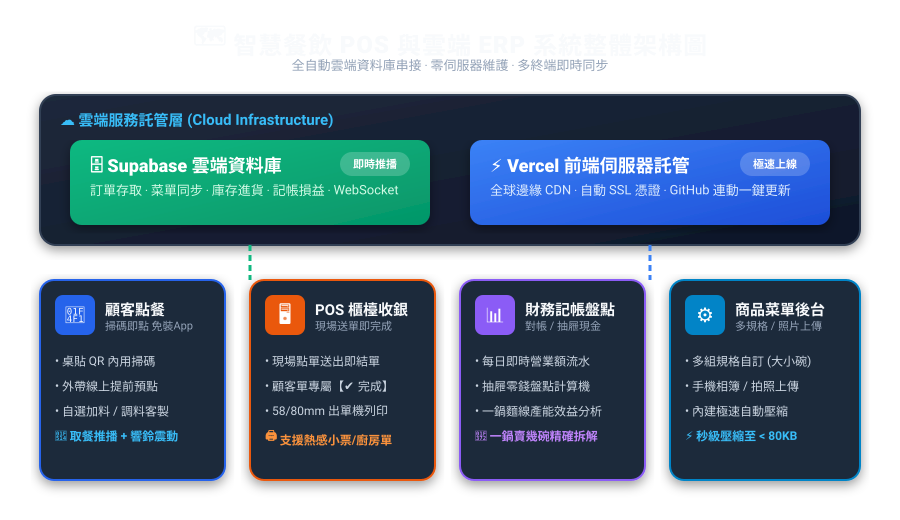
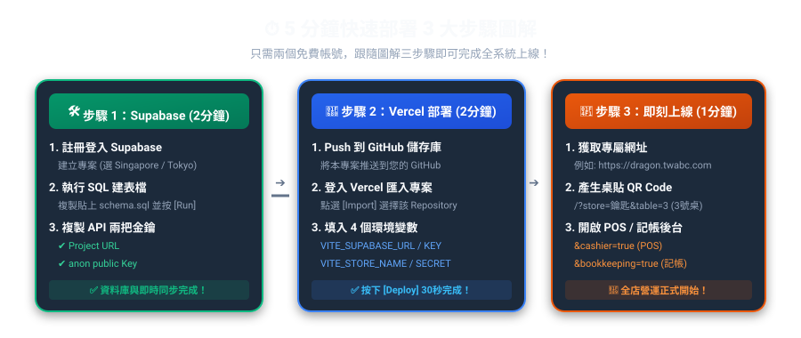
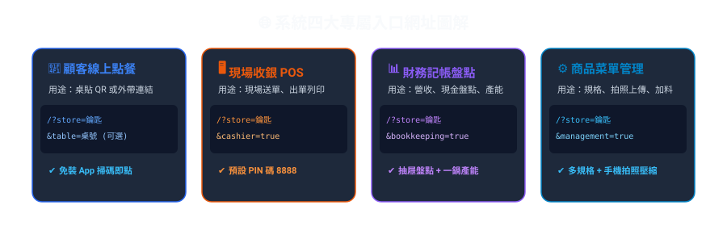
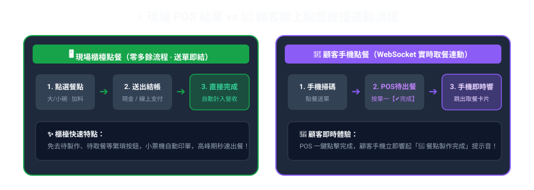
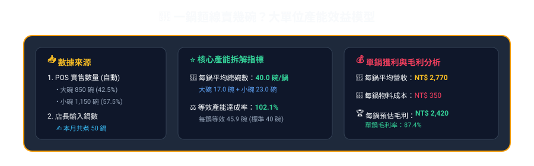
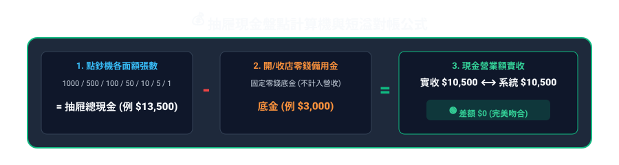

# 🚀 系統安裝與部署手冊 (5 分鐘圖解指南)

> 💡 **操作秘訣**：在 VS Code 中按下 **`Ctrl + Shift + V`**（或點擊右上角預覽圖示 📖），即可開啟圖文並茂的視覺版手冊！

---

## 🗺️ 1. 系統整體架構圖 (System Architecture)

---

## ⏱️ 2. 5 分鐘快速部署 3 步驟圖解 (Quick Setup)

---

### 🛠️ 步驟 1：建立 Supabase 雲端資料庫（2 分鐘）

1. 登入 [Supabase Dashboard](https://supabase.com/dashboard) 點擊 **「New Project」**（區域建議選 **Singapore** 或 **Tokyo**）。
2. 在左側選單點擊 **「SQL Editor」** ➔ **「New query」**。
3. 打開專案中的 `supabase_schema_universal.sql` 檔案，全選複製貼上後點擊綠色 **「Run」** 按鈕（顯示 `Success` 即代表建表完成）。
4. 在左側點擊 **「Project Settings (齒輪圖示)」** ➔ **「API」** 複製以下 2 個金鑰：
   * **Project URL**（例：`https://xxxx.supabase.co`）
   * **anon public** 金鑰（例：`eyJhbGciOi... `）

---

### 🚀 步驟 2：Vercel 一鍵免費託管部署（2 分鐘）

1. 將本專案 Push 推送到您的 GitHub 儲存庫。
2. 登入 [Vercel Dashboard](https://vercel.com) 點擊 **「Add New...」** ➔ **「Project」** 匯入該 GitHub Repository。
3. 在 **「Environment Variables」**（環境變數）中新增以下 4 個設定值：

| 變數名稱 (Key) | 說明與填寫範例 |
|---|---|
| `VITE_SUPABASE_URL` | 您的 Supabase Project URL（例：`https://xxxx.supabase.co`） |
| `VITE_SUPABASE_ANON_KEY` | 您的 Supabase Anon Public Key |
| `VITE_STORE_NAME` | 門市名稱（例：`龍城麵線` 或 `蘆洲七號店`） |
| `VITE_STAFF_SECRET_TOKEN` | 後台專屬安全鑰匙（例：`dg_8f2a1c`，**請自行修改**） |

4. 點擊 **「Deploy」** 按鈕，約 30 秒即可獲得上線網址（例：`https://dragon.twabc.com`）！

---

### 🌐 3. 系統四大專屬入口網址圖解（1 分鐘）

* **📱 顧客線上點餐（印製桌貼 QR）**：`https://您的網址/?store=安全鑰匙[&table=桌號]`
* **🖥️ 現場收銀 POS 系統**：`https://您的網址/?store=安全鑰匙&cashier=true`（預設 PIN: 8888）
* **📊 財務記帳與盤點中心**：`https://您的網址/?store=安全鑰匙&bookkeeping=true`
* **⚙️ 商品規格與菜單管理**：`https://您的網址/?store=安全鑰匙&management=true`

---

## 🌟 4. 2026 核心功能圖解指南

### ⚡ ① POS 現場送單即結 vs 📱 顧客手機即時連動

* **現場櫃檯點餐**：送單後自動直接結單計入營收，免去待製作/待取餐繁瑣切換。
* **顧客線上點餐**：POS 訂單卡片醒目標示紫色標籤，按下單一綠色【✔ 完成】，顧客手機即時震動並響起「🎉 餐點製作完成」通知。

---

### 🍲 ② 一鍋麵線賣幾碗？大單位產能效益模型

* **系統自動對帳**：自動從 POS 結算當月大碗（850碗/42%）與小碗（1,150碗/58%）銷量與營收。
* **輸入製作鍋數**：店長輸入本月煮了 50 鍋，系統即時算出：**每鍋平均 40.0 碗（大碗 17.0 + 小碗 23.0）**，並計算每鍋營收與淨毛利！

---

### 💰 ③ 抽屜現金盤點計算機

* **公式**：`各面額點鈔總額 - 開收店零錢備用金 = 當日現金營業額實收`。
* **自動對帳**：與系統營收即時比對短溢差額，吻合顯示綠色安全提示。

---

## 📂 文件位置索引

| 文件名稱 | 檔案路徑 | 用途說明 |
|---|---|---|
| 📖 **系統圖解安裝手冊 (本檔)** | `DEPLOYMENT_GUIDE.md` | 5 分鐘圖解安裝、環境變數與入口指南 |
| 📄 **系統全功能說明書** | `README.md` | 系統功能總覽、架構與技術堆疊說明 |
| 🖨️ **POS 出單機硬體指南** | `POS機台設定.md` | 熱感小票機與網路列印詳細設定步驟 |
